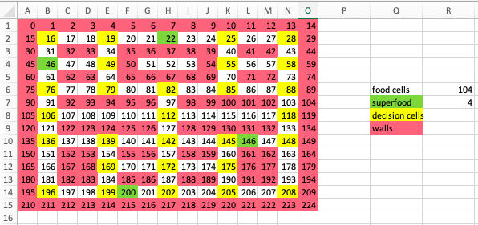
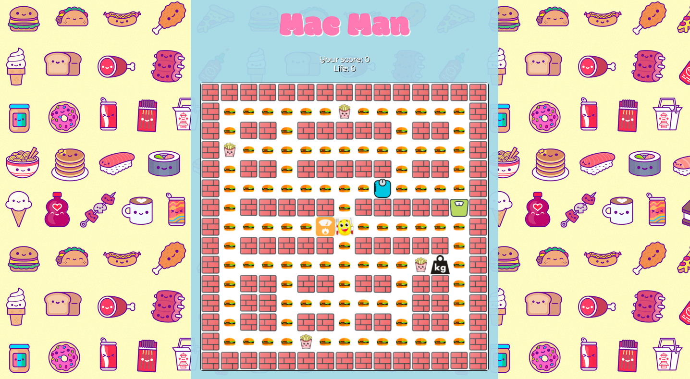

###  General Assembly, Software Engineering Immersive


# MacMan

## Overview
Mac Man is based on the 80s' classic arcade game.  It was my first big individual project that was a part of my `Software Engineering Immersive` course at General Assembly. The objective was to create a grid-based game to be rendered in a browser using `Vanilla JS`, `HTML`, and `CSS`. The project was to be completed within a week, and it gave me an opportunity to practice and apply knowledge gained thus far by interacting with `DOM objects`. 

Given a selection of games to recreate, I opted for Pac-Man with a personalised cartoon-like food theme where a player is collecting burgers and fries, while being chased by four different weight scales. 
In terms of 'ghost logic', I opted for randomised movements, and to make it more stimulating for the player, I increased the pace at which each scale was moving. 

To understand the following documentation, please note that the corresponding characters and elements of the orginal game are as follows:
* Pac-Man = `Eater`
* Ghosts = `Scale1`, `Scale2`, `Scale3`, `Scale4`
* Coins = `Food`
* Power pellet = `Powerfoood`

Given the time restrictions, the game is not fully developed and there are a few bugs. However, it has its MVP and you can play it [here](https://hvan307.github.io/MacMan/) and the GitHub repo can be accessed [here](https://github.com/hvan307/MacMan). 

# The Brief
- Render a game in the browser
- Design logic for winning & visually display which layer won
- Include separate HTML / CSS / JavaScript files
- Stick with KISS (Keep It Simple Stupid) and DRY Don't Repeat Yourself) principles
- Use Javascript for DOM manipulation
- Deploy your game online, where the rest of the world an access it
- Use semantic markup for HTML and CSS (adhere to best ractices)

## The Technologies used
- HTML5
- CSS3
- JavaScript (ES6)
- Git and GitHub
- Google Fonts
- Microsoft Excel 

# Approach 
## The Map
When creating a map, I decided to use Microsoft Excel to help me sketch out the board layout, as I found it useful to be able to colour-code the cells and have the cells numbered. 


To draw the grid, I pre-determined the height and width and defined cells as an empty array followed by a for loop to create divs, where each div would represent a cell. Additional classes are added depending on what the cell contains, e.g. a wall, a food item, or a superfood. Lastly, each cell is pushed into the empty cells array.

```js
  const height = 15
  const width = 15
  const gridCellCount = height * width
  const grid = document.querySelector('.grid')
  const cells = []
```
```js
  for (let i = 0; i < gridCellCount; i++) {
  const cell = document.createElement('div')
  cell.classList.add('cell')
  if (!cell.classList.contains('walls')) {
    cell.classList.add('food')
  }
```
To create `border walls`, I used a while loop, and because the default cells all include contain `food` class, this loop will remove those classes and add a wall class instead. To determine the cell positions, I opted for using width (instead of the actual fixed cell number) to make it more practical, i.e. if I needed to change the size of the map, I would only need to redefine the const height and width above. 
```js
  while (i <= width - 1 || i === width || i === width * 2 - 1 || i === width * 3 || i === width * 4 - 1 || i === width * 5 || i === width * 6 - 1 || i === width * 6 || i === width * 7 - 1 || i === width * 7 || i === width * 8 - 1 || i === width * 8 || i === width * 9 - 1 || i === width * 9 || i === width * 10 - 1 || i >= width * 14) {
      cell.classList.remove('food')
      cell.classList.add('walls')
      break
    }
```
Similarly, the `scattered walls` in the middle of the map were created using a while loop and followed a similar logic as the border walls.
```js
  while (i === width * 2 || i >= width * 2 + 2 && i <= width * 2 + 3 || i >= width * 2 + 5 && i <= width * 2 + 9 || i >= width * 4 + 5 && i <= width * 4 + 9 || i >= width * 3 - 4 && i <= width * 3 - 3 || i === width * 3 - 1 || i === width * 4 || i >= width * 4 + 2 && i <= width * 4 + 3 || i >= width * 5 - 4 && i <= width * 5 - 3 || i === width * 5 - 1 || i >= width * 6 + 2 && i <= width * 6 + 6 || i >= width * 7 - 7 && i <= width * 7 - 3 || i >= width * 8 + 2 && i <= width * 8 + 6 || i >= width * 9 - 7 && i <= width * 9 - 3 || i === width * 10 || i === width * 11 - 1 || i >= width * 10 + 2 && i <= width * 10 + 3 || i >= width * 10 + 5 && i <= width * 10 + 6 || i >= width * 11 - 7 && i <= width * 11 - 6 || i >= width * 11 - 4 && i <= width * 11 - 3 || i === width * 11 || i >= width * 11 + 2 && i <= width * 11 + 3 || i >= width * 12 - 4 && i <= width * 12 - 3 || i === width * 12 - 1 || i === width * 12 || i >= width * 12 + 2 && i <= width * 12 + 3 || i >= width * 12 + 5 && i <= width * 12 + 6 || i >= width * 13 - 7 && i <= width * 13 - 6 || i >= width * 13 - 4 && i <= width * 13 - 3 || i === width * 13 - 1 || i === width * 13 || i === width * 14 - 1) {
    cell.classList.remove('food')
    cell.classList.add('walls')
    break
  }
```
To place `powerfood` items, I replaced the div classes '`food`' with '`powerfood`'. 
```js
if (i === 22 || i === 46 || i === 146 | i === 200) {
      cell.classList.remove('food')
      cell.classList.add('powerfood')
    }
``` 
### Characters positions
Each character's position was predetermined like, and classes were added accordingly like so:
```js
let eaterPosition = 112
let scale1Position = 16
```
```js
if (i === scale1Position) {
    cell.classList.add('scale1')
  }
```

## Eater Movement
For the player (`eater`) movements, I used a simple keydown event listener for each of the arrow (up, down, left, right). To avoid going into a wall, I added an if statement that will check for the cell in front of the player's position.

For when the `eater` is caught by a `scale`, the `eater` class is removed from the current position and reposition back to the starting position (cell 112) after 1 second. This is also when the player will lose one life.

As the user moves through the map, there will be `food` and `powerfood` items all around. If the `eater` is in the cell that contains class '`food`' or '`superfood`', that class will be instantly removed, which indicates their collection. 

```js
document.addEventListener('keydown', (event) => {
  if (event.key === 'ArrowRight') {
    // CHECKING FOR WALLS AND SCALES
    if (cells[eaterPosition + 1].classList.contains('walls')) {
      return
    } if (eaterPosition === scale1Position || eaterPosition === scale2Position || eaterPosition === scale3Position || eaterPosition === scale4Position) {
      cells[eaterPosition].classList.remove('eater')
      livesCount -= 1
      setTimeout(() => {
        eaterPosition = 112
        cells[eaterPosition].classList.add('eater')
      }, 10)
    }
    cells[eaterPosition].classList.remove('eater')
    eaterPosition += 1
    cells[eaterPosition].classList.remove('food')
    cells[eaterPosition].classList.remove('powerfood')
    cells[eaterPosition].classList.add('eater')
```
## Scale Movement
Each `scale` has a single function to determine its movements. Using a `setInterval` at 150 milliseconds, the scales are moving at a relatively fast pace, and the direction of movements are randomised. 

To avoid scales 'merging' with walls, the checks are being made for one cell ahead of the scale's direction. If there is a wall ahead, one of the functions `randomBut<direction>()` are called. 

For instance, the example below illustrates the scale's current direction to be left. In this case, if there's a wall on in front (on the left from the user's perspective), and the scale's current position is top left corner, function `randomButLeftUp()` is called. The output will be a movement that was randomly selected from an array `directionButLeftUp`. 
```js   
const directionButLeftUp = ['right', 'down']

function randomButLeftUp() {
  const random = Math.floor(Math.random() * directionButLeftUp.length)
  return directionButLeftUp[random]
}
```
This essentially eliminates the possibility of going left and up where the walls are.

This logic is repeated for all potential 'wall merging' scenarios. 

```js
function scale1Chase() {
    const scale1Interval = setInterval(() => {
    // CURRENT DIRECTION - LEFT
    if (scale1PositionDirection === 'left') {
      // CHECKS FOR WALL CLASHES
      if (cells[scale1Position - 1].classList.contains('walls') && cells[scale1Position - width].classList.contains('walls')) {
        scale1PositionDirection = randomButLeftUp()
        return
      } else if (cells[scale1Position - 1].classList.contains('walls') && cells[scale1Position + width].classList.contains('walls')) {
        scale1PositionDirection = randomButLeftDown()
        return
      } else if (cells[scale1Position - 1].classList.contains('walls')) {
        scale1PositionDirection = randomButLeft()
        return
      } else if (cells[scale1Position - width].classList.contains('walls') && !cells[scale1Position - 1].classList.contains('walls')) {
        scale1PositionDirection = randomButRightUp()
        if (scale1PositionDirection === 'left') {
          cells[scale1Position].classList.remove('scale1')
          scale1Position--
          cells[scale1Position].classList.add('scale1')
          return
        }
        return
      }
      cells[scale1Position].classList.remove('scale1')
      scale1Position--
      cells[scale1Position].classList.add('scale1')
    }
  }, 150)
}
scale1Chase()
```
## Collisions
In the event of `scale` and `eater` collision, the player loses one life and is the `eater` is returned to its starting position after 10 milliseconds. The setTimeout was added to allow the time necessary for a smoother transition and to avoid the `eater` appearing in two different locations at the same time.
```js
if (scale1Position === eaterPosition) {
  cells[eaterPosition].classList.remove('eater')
  livesCount -= 1
  lives.value = livesCount
  lives.innerHTML = `Life: ${livesCount}`
  setTimeout(() => {
    eaterPosition = 112
    cells[eaterPosition].classList.add('eater')
  }, 10)
}
```
To avoid overlapping of the `scales`, the position checks are done for the cell ahead, rather than the character's actual current position. This will prevent the characters to 'fuse' together where one, or the other, visually disappears from the map from the player's perspective. 
```js
if (cells[scale1Position + 1] === scale2Position || cells[scale1Position + 1] === scale3Position || cells[scale1Position + 1] === scale4Position) {
  return
}
```
## Variables
- `player`: the index of the cell the player is on
- `score`: every time the player moves onto a cell with the food class on it, 1 is added to the score; if the player collides with a ghost while the state frightened is true, 100 is added to the score.
- `lives`: starts at 3 and every time the player collides with a non-frightened ghost, 1 life is taken away; if lives === 0, the player has lost and the game ends.
- `foodCount`: counts down from the total amount of food on the board (200) every time the player lands on a cell with the food class on it; if it foodCount === 0, the player has won and the game ends.


## Bugs
1. After a user loses a life, the `eater` will go back to its starting position in the middle of the map. However, occasionally the eater image will stay behind in the position where the user lost the life if the user tries to move to quickly on the board. This will result in seemingly 'doubling up' of the eater character, as you will see 2 of them on the map (except one will the be a static image and will not be moving - the non-moving eater will always be the one in the collision position). As a player, you can move to that location and go over it to 'merge' the two eaters together. 

    This issue occurs likely because I opted for adding and removing the class names when manipulating DOM objects as the character moves in and out of each cell. An alternative would be to toggle between the display styles instead.

2. The scores are currently being added as many times as the user enters the cell, rather than when the food or powerfood is collected.

## Challenges
The 'ghost logic' was the biggest challenge in this project. In the original game the ghosts characters are so complex, which I did not realise until I started the project, as I have not played the game for many years. Having to research the game itself required a lot of time, which put a strain on the actual development of the game.

## Lesson learned
This project was a great learning experience in terms of 'expectation vs reality', as well as to manage my time better moving forward. First of all, even though I knew it would be very challenging, I chose to do Pacman because I wanted to push myself. 

As I started this project, I set myself to achieve much more than I actually accomplished, but you can imagine that having no prior experience with developing games, realistically, I did not know what is achievable within the given time frame at the level I was. 

I believe my weakness was not utilising the online resources enough because I feared it would be cheating. Moreover, when I got stuck on the ghost logic, I should have given myself a strict time limit and asked for help if I couldn't find a solution by the deadline. 
This would give me more time to fix the bugs and minor issues, so I can have a more polished finished product, even if it's simple. During this process, I also learned that the developers community is there for a reason. You will not know all the answers and it's ok to use Google more often.

## Potential additional features
* Localstorage for the leader scoreboard 
* A 'scare mode' for the scales when the powerfood is eaten, so that the Eater can catch a scale and send it back to its starting position
* Mobile-friendly version
* Creating 'identities' and different behavioural patterns for each of the scales
* Further levels and alternative maps


## Screenshots



## Credits
The character images were sourced from multiple websites using mainly a combination of Google Images and Giphy.


